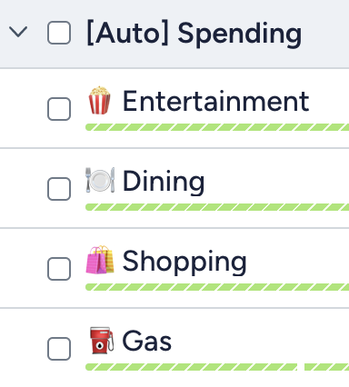

# YNAB ChatGPT Categorizer
Oh YNAB, you presume too much. The idea - brilliant. The app - [it insists upon itself](https://youtu.be/mYAi5aI_NPc?si=HaQmCC_toGnjEQr6&t=21). Every other app that costs ~100 $/mo automates, visualizes, and summarizes far better. 

Fine! YOU WIN! I do, in fact, need a budget... 

This repo uses ChatGPT to auto-categorize transactions, and mark them with a visible blue flag in-app. State between runs is serialized to a local SQLite DB to avoid unnecessary API calls.


## Instructions
Transactions already tagged with categories will not be considered.

Uncategorized transactions will attempt to be matched to Categories that fall in Category-Groups that start with "[Auto]" (case-insensitive).



In the example shown in the image, the categories eligible for auto-categorization are "Entertainment", "Dining", "Shopping", and "Gas".

Transactions that have been auto-categorized are marked with a blue flag.

## Cost
You'll need to bring your own OpenAI GPT token. At the moment GPT 3.5 is $0.50 / 1M input tokens, and $1.5 / 1M output tokens [[pricing page](https://openai.com/pricing)]. For me, each uncategorized transaction uses about ~85 input tokens, and ~2 output tokens. All things considered, very cheap.

YNAB is 99 $/yr, and you don't pay any extra for an API key. You're rate-limited for 200 requests per hour. Each script run uses 3 requests. Meaning you can run this script every minute if you want.

## Build & Deployment

Docker
```
docker build -t aelzeiny/ynab-gpt .
docker run \
    -e OPENAI_API_KEY=$OPENAI_API_KEY \
    -e YNAB_API_KEY=$YNAB_API_KEY \
    -v ./db.sqlite:/app/db.sqlite \
    aelzeiny/ynab-gpt
```

Crontab, every 5 minutes (absolute paths recommended)
```
crontab -e
*/1 * * * * docker run -e OPENAI_API_KEY=$OPENAI_API_KEY -e YNAB_API_KEY=$YNAB_API_KEY -v ./db.sqlite:/app/db.sqlite aelzeiny/ynab-gpt > path_to_logs.log
```

## Unsolicited App Reviews
I spent time in `YNAB`, `Copilot`, and `Monarch` and came out with a clear winner for my existing needs. Copilot was a VERY close second. If money wasn't tight, I would prefer Copilot. Monarch, a distant third. 
I tried 3 apps for a few weeks, and here are my opinions.
* `YNAB` -> **Best** for Budgeting. It’s in the name. **But** I wish it automated more.
* `Copilot` -> **Best** for visualizations, auto-categorization, recurring expense tracking, dashboards, and overviews. But I wish it did budgeting.
* `Monarch` -> **Most** well-rounded. But I wish it did better at auto-categorization & recurring expenses & budgets instead of targets.

## ToDo
I should probably store data in a stateful sqlite database. Something queriable tabulating runs. YNAB API supports a feature called `server_knowledge` for delta-requests. This will likely save me tokens in the long-run.